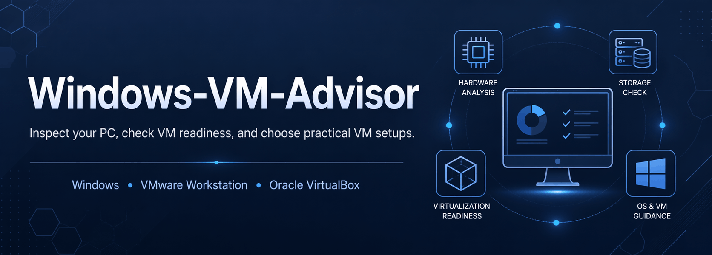

<p align="center">
  
</p>

# Windows-VM-Advisor

[](https://github.com/lorenzocaputodev/Windows-VM-Advisor/actions/workflows/ci.yml) [](LICENSE)  

A lightweight Windows tool that inspects the current PC, evaluates virtualization readiness, ranks practical guest OS options, and generates clear result files for manual VM setup in **VMware Workstation** or **Oracle VirtualBox**. It runs fully locally, and rankings depend only on the hardware, not on what is running at the moment.

---

## ✅ What it does

- Inspects the current Windows host for VM-relevant hardware and system details
- Evaluates practical VM readiness with clear blockers, limitations, and takeaways
- Ranks sensible guest OS options using a simple local ruleset
- Suggests practical starting VM profiles for usable guests
- Identifies the best storage location for VM files when multiple drives are available
- Writes clean user-facing output files plus a stable `Details.json`

---

## 🚀 Quick start

**Requirements:** Windows 10 or 11 (x64) with the built-in Windows PowerShell 5.1. Nothing to install.

1. Download the repository as a ZIP (or `git clone` it) and extract it.
2. Run `Windows-VM-Advisor.bat`, ideally as administrator. Without elevation some checks (TPM, Hyper-V state) cannot be verified and the report says so.

You can also launch it from PowerShell:

```powershell
.\Windows-VM-Advisor.bat
```

### Public options

- `-Guest auto|windows|linux` — bias the ranking toward a guest family (default `auto`)
- `-Mode light|balanced|performance` — how generous the suggested VM profiles are (default `balanced`)
- `-Hypervisor auto|vmware|virtualbox` — preferred hypervisor; the tool falls back to the other one if yours is blocked or clearly worse (default `auto`)
- `-ResultsRoot <path>` — where to write results

### Examples

```powershell
.\Windows-VM-Advisor.bat -Guest auto -Mode balanced
.\Windows-VM-Advisor.bat -Guest linux -Mode performance
.\Windows-VM-Advisor.bat -Guest windows -Mode light
.\Windows-VM-Advisor.bat -Hypervisor virtualbox
```

### Advanced usage

Advanced PowerShell usage is available through the internal entrypoint:

```powershell
powershell -ExecutionPolicy Bypass -File .\src\entrypoints\Start-Windows-VM-Advisor.ps1
```

---

## 🧭 How it works

Windows-VM-Advisor follows a simple flow:

**host analysis → readiness evaluation → guest ranking → VM profile suggestions**

A successful run writes results to:

- `Results\latest\`
- `Results\archive\YYYYMMDD-HHMMSS\`

If the project folder is read-only (for example under `Program Files`), results go to `%LOCALAPPDATA%\Windows-VM-Advisor\Results` instead. Use `-ResultsRoot` to choose another location.

---

## 📄 Output files

Each run generates:

- `System-Info.txt` — hardware, firmware, storage, hypervisor, and Windows feature summary
- `VM-Readiness.txt` — readiness state, blockers, limitations, checks, and takeaway
- `ISO-Recommendations.txt` — ranked guest list with best-fit guidance
- `VM-Profiles.txt` — suggested starting VM settings for usable guests
- `Details.json` — stable machine-readable output

Sample files for all five outputs are in [`examples/`](examples/).

---

## 🖥️ Supported hypervisors

- VMware Workstation (Pro is free for personal and commercial use)
- Oracle VirtualBox

---

## 💿 Supported guest catalog

### Windows
- Windows 10 (end of support since October 2025, never ranked above *Possible*)
- Windows 11

### Linux
- Linux Mint
- Ubuntu LTS
- Debian Stable
- Fedora Workstation
- openSUSE Leap
- Lubuntu
- Kali Linux
- Arch Linux
- Rocky Linux
- NixOS

### Unix-like / BSD
- FreeBSD

**Note:** leaner or specialized Windows variants such as LTSC or IoT can still make sense in specific scenarios, but they are intentionally kept out of the main catalog to keep the tool simple and focused.

---

## ⚠️ Limitations

- It does not download ISOs
- It does not create or modify VMs
- It targets **x64 Windows hosts only** (ARM and 32-bit hosts are reported as not ready)
- Rankings are local and deterministic, not based on live popularity or download data
- Detection quality may be reduced on restricted systems or when some Windows commands are unavailable

---

## 🛠️ Development

Bootstrap the development environment:

```powershell
powershell -ExecutionPolicy Bypass -File .\scripts\bootstrap-dev.ps1
```

Run the test suite:

```powershell
powershell -ExecutionPolicy Bypass -File .\scripts\run-tests.ps1
```

Lint the source with PSScriptAnalyzer (requires `Install-Module PSScriptAnalyzer -Scope CurrentUser`):

```powershell
powershell -ExecutionPolicy Bypass -File .\scripts\run-lint.ps1
```

Regenerate the sample files in `examples/` after changing rules, catalog, or formatters:

```powershell
powershell -ExecutionPolicy Bypass -File .\scripts\update-examples.ps1
```

Validate the sample output contract:

```powershell
powershell -ExecutionPolicy Bypass -File .\scripts\validate-sample-report.ps1
```

Further technical documentation:

- `docs/architecture.md` — runtime structure and layering
- `docs/data-model.md` — `Details.json` contract and field layout
- `docs/rules.md` — readiness, ranking, and VM profile rules

---

## 📁 Repository structure

- `Windows-VM-Advisor.bat` — main launcher for Windows users
- `src/entrypoints/Start-Windows-VM-Advisor.ps1` — internal PowerShell entrypoint
- `src/` — collectors, rules, catalog, output formatters, utilities, and internal CLI
- `scripts/` — bootstrap, test, lint, validation, and catalog link-check helpers
- `tests/` — unit and integration tests
- `schemas/` — JSON schema for `Details.json`
- `examples/` — sample output files
- `docs/` — technical documentation
- `.github/workflows/` — CI workflow
- `CHANGELOG.md` — release notes
- `LICENSE` — MIT

---

## 🎯 Scope

Windows-VM-Advisor is not a VM manager.

It is a focused assessment tool for answering three practical questions:

1. **Is this Windows host in a good state for VM use?**
2. **Which guest types make the most sense here?**
3. **What is a safe and sensible starting profile for each one?**

---

## 🤖 AI assistance

This project was designed and refined by me, with targeted AI support in selected phases such as code review, refactoring, copy polishing, and visual or technical refinement.

AI was used as a support tool, not as a substitute for my work. Direction, final decisions, validation, and overall quality were handled by me.